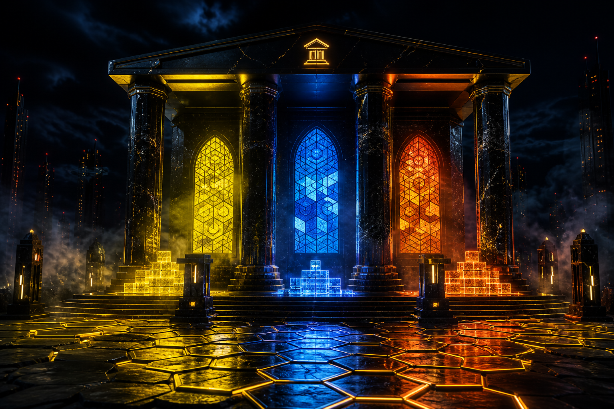

# 🛕 FED-TEMPLE — The Digital Monument

> Turn your GitHub contribution history into an interactive **3D cathedral**.
> Bricks are commits. Golden tiles are stars. Pillars are forks. Stained glass is languages.
> **100% browser-native. No API keys. No server. No auto-commits. No bullshit.**

<p align="center">
  
</p>

---

## ✦ What is this

FED-TEMPLE is part of the **[FED-OS](https://github.com/FED-OS)** ecosystem. It takes a GitHub username, mines the public REST API (CORS-enabled, no token required), and forges a walkable 3D temple in your browser using **Three.js**.

| GitHub signal | Becomes in the temple |
|---|---|
| Commits | **Bricks** — stacked chronologically, colored by the repo's primary language |
| Stars | **Golden tiles** — glowing hexagons scattered on the ground |
| Forks | **Pillars** — fluted marble columns around the perimeter |
| Languages | **Stained-glass windows** — sized by bytes of code written |
| Contributors | **Ghosts** — translucent figures that wander the grounds |
| Recent activity | **Aura ring** — a glowing torus whose brightness reflects the last burst of work |

## ✦ Features

**MVP (shipped)**
- ⛏ One-click build — enter a username, watch the temple rise brick-by-brick
- 📊 Live stats panel + interactive language pills (click to dim a language's bricks)
- 🖱 Click any brick → modal with the commit message, date, repo, and a link to GitHub
- 🔗 Shareable links — the whole temple is compressed (`lz-string`) into the URL hash, no server
- 💾 Download as standalone HTML — a self-contained file you can open offline or embed
- 📸 Snapshot to PNG — one-click high-res screenshot for social flexing
- 🗑 Cancel button (AbortController) + graceful error toasts
- 💾 24h `localStorage` cache so you never hammer the GitHub rate limit while iterating
- 📱 Responsive + touch-friendly OrbitControls
- ✨ Demo mode auto-loads on first visit so newcomers see magic instantly

**Hidden gems**
- 👻 Ghosts of contributors wandering the grounds
- 🔄 Auto-orbit on load + resumes after 30s of idle
- 🏚 Fallen-ruins empty state when a user has zero commits
- 🪐 Aura ring that pulses with recent activity
- ✦ Hidden Eternal Commit relic (appears on temples with 5,000+ bricks)
- 🖥 ASCII-art loader while WebGL warms up
- ⌨️ Keyboard shortcuts: `R` reset camera · `S` snapshot · `H` toggle UI

## ✦ Quick start

```bash
git clone https://github.com/FED-OS/FED-TEMPLE.git
cd FED-TEMPLE
# no install, no build step — just open it
python3 -m http.server 8000
# → http://localhost:8000
```

Or open `index.html` directly in a modern browser (Chrome, Firefox, Edge, Safari).
A local server is recommended so ES module imports resolve cleanly.

## ✦ Deploy

It's static. Drop the folder on any host:

- **GitHub Pages** — push to `main`, enable Pages on the repo settings. See [DEPLOYMENT.md](DEPLOYMENT.md).
- **Netlify / Vercel / Cloudflare Pages** — drag-and-drop the folder.
- **Any static bucket** (S3, R2, GCS) — upload `index.html`, `styles.css`, `scripts/`, `social-image.png`.

## ✦ Rate limits

The public GitHub API allows **60 requests/hour** per IP, unauthenticated.
FED-TEMPLE is engineered around this:

1. It fetches commits only for your **top 5 repos by stars** (caps the request count).
2. It paginates commits with a hard cap of **5,000 bricks**.
3. It caches the blueprint in `localStorage` for **24 hours**, so refreshes are free.

If you hit the limit, wait ~1 hour or supply a Personal Access Token (PAT support is on the roadmap — see [ROADMAP.md](ROADMAP.md)).

## ✦ Tech stack

- **Three.js r160** (ESM via CDN import map — no bundler)
- **OrbitControls** + **InstancedMesh** for thousands of bricks at 60fps
- **lz-string** for URL-hash compression
- **Vanilla JS + CSS** — zero dependencies, zero build step, zero nonsense

## ✦ Project structure

```
FED-TEMPLE/
├── index.html              ← the app (open this)
├── styles.css              ← brutalist dark theme
├── scripts/temple.js       ← core engine: fetch + forge + interact
├── social-image.png        ← Open Graph preview
├── .github/                ← issue templates, workflows, discussions
├── prompts/                ← starter prompts for AI-assisted dev
├── wiki/  discussion/      ← knowledge stubs
└── docs: README, CONTRIBUTING, ROADMAP, DEPLOYMENT, BUILD, INSTALL,
         ADR, SECURITY, SUPPORT, CHANGELOG, FAQ, NOTICE, CITATIONS,
         COPYING, GOVERNANCE, PRICING, SUMMARY, CLAUDE, AGENTS,
         AUTHORS, MAINTAINERS
```

## ✦ Roadmap

See [ROADMAP.md](ROADMAP.md) for the full plan. Highlights:

- ⏳ Time-lapse slider (scrub the temple building across history)
- 🎨 Theme presets (matrix, ember, light)
- 🧊 glTF/OBJ export for Blender / 3D printing
- 🔐 Private repos via client-side PAT (token never leaves the browser)
- 🔊 Ambient audio drone keyed to temple height
- 🖼 Dynamic Open Graph image generation

## ✦ Contributing

Yes. Read [CONTRIBUTING.md](CONTRIBUTING.md). Keep it brutalist, keep it browser-native, keep it bullshit-free.

## ✦ Support the forge

<p>
  <a href="https://ko-fi.com/YOUR_USERNAME" target="_blank" rel="noopener">
    
  </a>
</p>

Replace `YOUR_USERNAME` in `index.html` and `README.md` with your Ko-fi handle.

## ✦ License

[MIT](LICENSE) — © 2026 FED-OS. Build cathedrals, not walled gardens.
